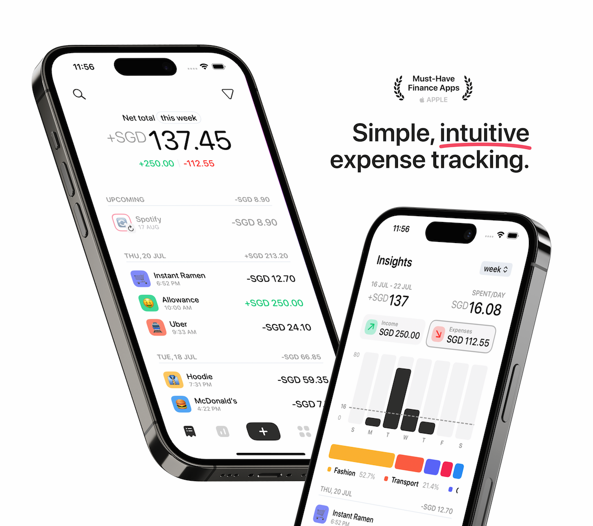
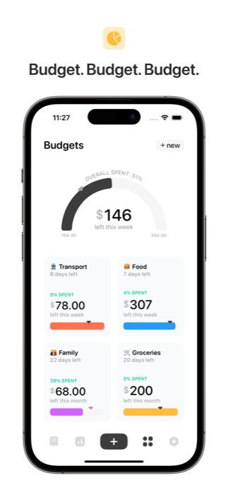
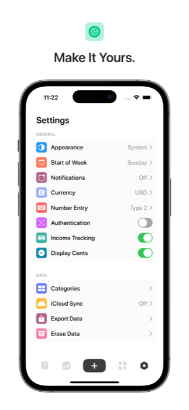
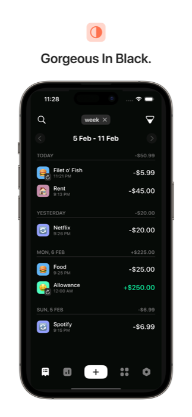
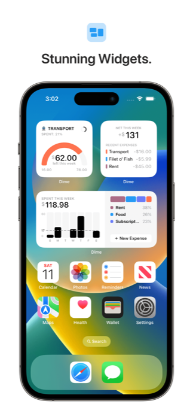

# Dime

  

A 100% free personal finance tracker built with iOS design guidelines in mind. [Download Dime on the App Store.](https://apps.apple.com/sg/app/dime-budget-expense-tracker/id1635280255)

## App Preview

   
   
  
  

  
  
  

## Why You’ll Love Dime

- 100% free forever, with no paywall or ads.
- Beautifully iOS-centric design, with simplicity at its core.
- Insightful expenditure breakdowns over various time periods.
- Create budgets based on expense categories and stick to them.
- Create recurring expenses with custom time frames.
- Sync your expenses, categories and budgets with other devices via iCloud.
- Custom reminders to input your expenses.
- Biometric authentication to protect your data.
- Home screen quick actions make capturing new expenses a breeze.
- A gorgeous night theme for dark mode fanatics.
- Informative home and lock screen widgets keep you updated at a glance.

## Licence

This project is licensed under the GNU General Public License v3.0 - see the [LICENSE](LICENSE) file for details.

## Contributing

If you have any bug reports or feature requests, please go through [existing issues](https://github.com/rarfell/dimeApp/issues) or [create one](https://github.com/rarfell/dimeApp/issues/new/choose) if it doesn't exist yet.
