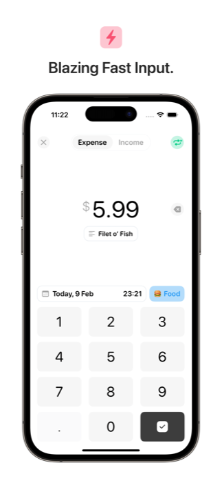
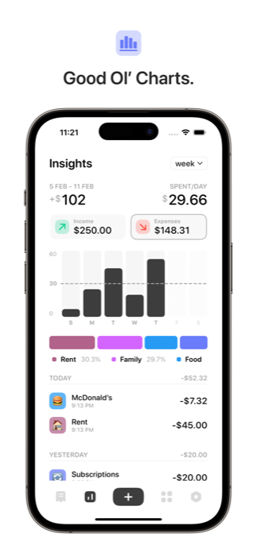
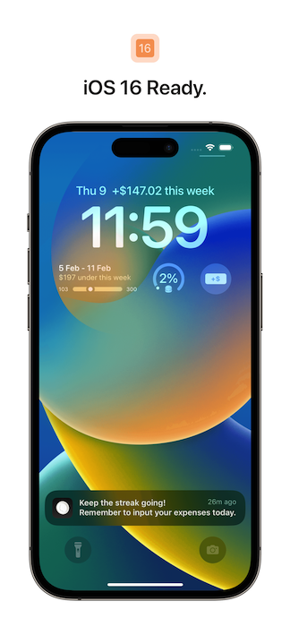

# Dime

  

Dime is a 100% free, open-source personal finance tracker built with iOS design guidelines in mind. [Download Dime on the App Store.](https://apps.apple.com/sg/app/dime-budget-expense-tracker/id1635280255)

## App Preview

   
   
  
  

  
  
  

## Why You’ll Love Dime

- 100% free forever, with no paywall or ads.
- Beautifully iOS-centric design, with simplicity at its core.
- Insightful expenditure breakdowns over various time periods.
- Create budgets based on expense categories and stick to them.
- Create recurring expenses with custom time frames.
- Sync your expenses, categories and budgets with other devices via iCloud.
- Custom reminders to input your expenses.
- Biometric authentication to protect your data.
- Home screen quick actions make capturing new expenses a breeze.
- A gorgeous night theme for dark mode fanatics.
- Informative home and lock screen widgets keep you updated at a glance.

## How to help

- Please feel free to raise [issues](https://github.com/rarfell/dimeApp/issues) for any inquiries, suggestions for improvements, or bugs you encounter.
- You're welcome to fork the repository and propose changes through a pull request, although the decision to merge it rests with the project maintainers.
- To follow along with app updates, follow [@budgetwithdime](https://x.com/budgetwithdime) on X / Twitter
- If you would like to discuss with the contributors, feel free to drop [Rafael](https://x.com/rarfell) or [Jeffrey](https://x.com/jefcodes) a DM!

## How to build

### Required

- Xcode

### Build Steps

- Clone this project either via Xcode or terminal:
  `git clone https://github.com/rarfell/dimeApp.git`
- For branch selection use:
  `--single-branch --branch [branchname]` after `clone`
- After completion, open `dime.xcodeproj` using Xcode.
- Please let all dependecies update automatically but we would recommend to run
  `File > Packages > Resolve Package Versions` to ensure, everything is updated.

## Third party dependencies

- [Alamofire](https://github.com/Alamofire/Alamofire)
- [CloudKitSyncMonitor](https://github.com/ggruen/CloudKitSyncMonitor)
- [ConfettiSwiftUI](https://github.com/simibac/ConfettiSwiftUI)
- [CrookedText](https://github.com/duemunk/CrookedText)
- [SwiftUI Introspect](https://github.com/siteline/swiftui-introspect)
- [IsScrolling](https://github.com/fatbobman/IsScrolling)
- [Popovers](https://github.com/aheze/Popovers/)
- ScrollViewStyle
- STools

## Licence

This project is licensed under the GNU General Public License v3.0 - see the [LICENSE](LICENSE) file for details.
